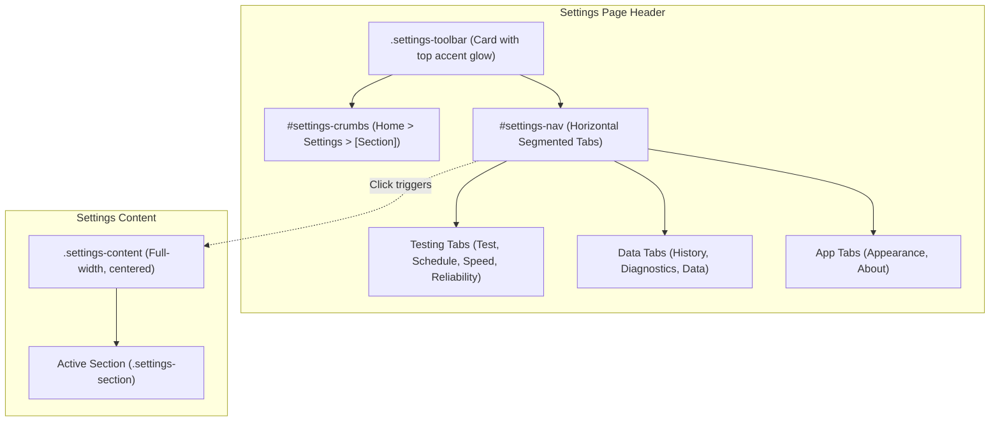

# Settings Tabs & Distinctive Header Implementation Plan

> **For agentic workers:** REQUIRED SUB-SKILL: Use superpowers:subagent-driven-development to implement this plan task-by-task. Steps use checkbox (`- [ ]`) syntax for tracking.

**Goal:** Transform the Settings page navigation from a legacy vertical list into a professional top toolbar with dynamic breadcrumbs, glowing accent line, and modern horizontal segmented tabs, matching the look and feel of the Providers page.

**Architecture:**
The Settings page layout is updated from a two-column grid (`settings-nav` + `settings-content`) to a single-column layout headed by a `.settings-toolbar` card (sharing the design patterns of `.pv-toolbar`). The toolbar contains dynamic breadcrumbs (`#settings-crumbs`) on the top-left and a sleek horizontal segmented tabstrip (`#settings-nav`) with category dividers.

**Architecture Diagram:**

**Tech Stack:** Vanilla JavaScript, HTML5 semantic markup, CSS3 custom properties & glassmorphism, Electron 33.

## Global Constraints
- Must match `.pv-toolbar` design language (border, border-radius, background, accent glow line `::before`).
- All 9 existing settings sections and their form fields/actions must remain fully functional.
- Flawless appearance in both Dark (`vercel`) and Light (`daylight`) themes.
- Responsive horizontal scrolling for tabs if viewport width is narrow.

---

### Task 1: Update HTML Structure in `src/renderer/index.html`

**Files:**
- Modify: `src/renderer/index.html:470-500`

- [ ] **Step 1: Replace legacy `.settings-header` and vertical `.settings-nav` with `.settings-toolbar`**
Wrap the top of `page-settings` with `.settings-toolbar` containing `#settings-crumbs` and `#settings-nav` (as a horizontal tab bar with category dividers).
- [ ] **Step 2: Verify HTML syntax and DOM structure**

---

### Task 2: Update Styles in `src/renderer/styles.css`

**Files:**
- Modify: `src/renderer/styles.css:5540-5680`

- [ ] **Step 1: Define `.settings-toolbar` and glowing top accent bar**
- [ ] **Step 2: Style `#settings-crumbs` and `#settings-nav` horizontal tabs with icons, hover and active states**
- [ ] **Step 3: Update `.settings-body` and `.settings-content` for full-width centered layout**
- [ ] **Step 4: Add dark theme (`[data-theme="vercel"]`) and light theme (`[data-theme="daylight"]`) overrides**

---

### Task 3: Update Controller Logic in `src/renderer/app.js`

**Files:**
- Modify: `src/renderer/app.js:3600-3630`

- [ ] **Step 1: Add dynamic breadcrumb rendering function for settings**
- [ ] **Step 2: Update `#settings-nav` click handler to refresh breadcrumbs on tab switch**
- [ ] **Step 3: Call settings breadcrumb render in `prepareSettingsPage()`**

---

### Task 4: Visual Verification & Testing

**Files:**
- Run: `scripts/capture-settings.js`

- [ ] **Step 1: Capture screenshot of Settings page in Light theme (`daylight`)**
- [ ] **Step 2: Capture screenshot of Settings page in Dark theme (`vercel`)**
- [ ] **Step 3: Test tab switching to verify other sections (e.g. Schedule, Appearance)**
- [ ] **Step 4: Inspect visual screenshots to ensure professional finish**
