# new-api study, part 2: data model and persistence layer

Clean-room study for VENOM Router. Source: `new-api-research` at commit `c2b7a9a` (read-only, not run).
new-api is AGPL-3.0. This document describes schemas, behaviour and design decisions in our own words, with
`file:line` references into that tree. It does not reproduce source code. All paths below are relative to the
new-api repository root.

Stack: Go, Gin, GORM v1.25.12 (`go.mod:61-68`), drivers for SQLite (pure-Go `glebarez/sqlite` on top of
modernc), MySQL, PostgreSQL (pgx) and ClickHouse (logs only), go-redis v8.

---

## 0. Summary of the most important findings

1. **One flat GORM schema, ~37 tables, zero foreign keys.** Every relation is an implied integer column
   (`user_id`, `channel_id`, ...). Integrity is enforced in Go, sometimes with advisory locks. There is no
   association field or `constraint:` tag anywhere in `model/`.
2. **The routing table (`abilities`) is a denormalised projection** of two comma-separated columns on
   `channels` (`group`, `models`). It is rebuilt by delete-and-reinsert on every channel edit, and the hot path
   does not even read it when the memory cache is on: it rebuilds a `group -> model -> [channel ids]` map straight
   from `channels` every 60 s (`model/channel_cache.go:26-107`).
3. **Money is an integer "quota" unit: 500,000 quota = 1 USD** (`common/constants.go:22`). Billing is
   reserve-then-settle. The reserve is an atomic conditional decrement (Redis Lua when Redis is on, a
   `WHERE quota >= ?` UPDATE otherwise, `model/quota_reserve.go:144-240`). With `BATCH_UPDATE_ENABLED`, DB
   writes are coalesced in process memory for 5 s, so a crash loses up to 5 s of charges.
4. **Schema evolution is AutoMigrate on every master boot plus hand-written, idempotent pre/post fix-ups**
   (`model/main.go:320-393`). There is no version table, no down migrations, no migration lock across
   masters. Most of the fix-up code exists to repair drift between the three SQL dialects.
5. **Logs are the scaling problem and get their own database** (`LOG_SQL_DSN`, optionally ClickHouse with TTL
   and monthly partitions). The `logs` table carries ~14 indexes, is written on every request, and is
   cleaned only by an admin-triggered batch job (or ClickHouse TTL).
6. **Settings are a string key/value table (`options`)** loaded into a global map at boot and fully re-read
   every `SYNC_FREQUENCY` seconds (default 60) on every node. Secrets (payment keys, OAuth secrets, SMTP
   token) and upstream API keys (`channels.key`) and user API keys (`tokens.key`) are stored in plaintext.

---

## 1. ER overview

Solid lines are implied references (no DB-level FK exists). Only the main relations are drawn; section 3 has the
complete list.

```mermaid
erDiagram
    users ||--o{ tokens : "user_id"
    users ||--o{ logs : "user_id (other DB)"
    users ||--o{ top_ups : "user_id"
    users ||--o{ redemptions : "used_user_id"
    users ||--o{ user_subscriptions : "user_id"
    users ||--o{ subscription_orders : "user_id"
    users ||--o{ user_sessions : "user_id"
    users ||--o| two_fas : "user_id unique"
    users ||--o{ two_fa_backup_codes : "user_id"
    users ||--o| passkey_credentials : "user_id unique"
    users ||--o{ external_identity_claims : "user_id"
    users ||--o{ user_oauth_bindings : "user_id"
    users ||--o{ checkins : "user_id"
    users ||--o{ tasks : "user_id"
    users ||--o{ midjourneys : "user_id"
    users ||--o{ quota_data : "user_id"
    users |o--o{ users : "inviter_id"
    custom_oauth_providers ||--o{ user_oauth_bindings : "provider_id"
    channels ||--o{ abilities : "channel_id"
    channels ||--o{ logs : "channel_id"
    channels ||--o{ tasks : "channel_id"
    tokens ||--o{ logs : "token_id"
    subscription_plans ||--o{ user_subscriptions : "plan_id"
    subscription_plans ||--o{ subscription_orders : "plan_id"
    user_subscriptions ||--o{ subscription_pre_consume_records : "user_subscription_id"
    vendors ||--o{ models : "vendor_id"
    system_tasks }o--|| system_task_locks : "type"
    authz_roles ||--o{ casbin_rule : "role key in v0/v1"
```

Logical (by-value, not by-id) links that matter for routing and billing:

- `abilities.group` matches `users.group` / `tokens.group` (a string "group" is the pricing tier and routing
  pool at the same time).
- `abilities.model` matches `models.model_name` using the model's `name_rule` (exact / prefix / contains /
  suffix, `model/model_meta.go:15-18`, `model/model_meta.go:64`).
- `logs.username`, `logs.token_name`, `logs.model_name`, `logs.group` are denormalised copies taken at request
  time, so logs survive deletion of the user/token and can live in a different database.
- `subscription_pre_consume_records.request_id` equals `logs.request_id` of the request it paid for.
- `tasks.platform` equals `task_plugins.key` for plugin-driven async tasks.

---

## 2. Type conventions (applies to every table below)

GORM derives SQL types from Go types unless a `type:` tag overrides them. Knowing the defaults explains several
dialect bugs later.

| Go type | MySQL | PostgreSQL | SQLite |
|---|---|---|---|
| `int` / `int64` (no tag) | `bigint` | `bigint` | `integer` |
| `int` with `type:int` | **`int` (32-bit)** | `integer` (32-bit) | `integer` |
| `string`, no size, not indexed, no default | `longtext` | `text` | `text` |
| `string`, no size, indexed / defaulted / PK | `varchar(191)` | `text` | `text` |
| `bool` | `boolean` (tinyint(1)) | `boolean` | `numeric` |
| `float64` | `double` | `double precision` | `real` |
| `time.Time` | `datetime(3)` | `timestamptz` | `datetime` |
| `gorm.DeletedAt` | nullable `datetime(3)` | nullable `timestamptz` | nullable `datetime` |
| custom JSON struct with `type:json` | `json` | `json` | `json` (text affinity) |

Nullability: GORM adds `NOT NULL` only when tagged, so unless marked **NN** below a column is nullable at the DB
level even if Go never writes NULL. Pointer fields (`*string`, `*int64`) are deliberately nullable. A field named
`Id`/`ID` is the auto-increment primary key.

Several tags say `gorm:"bigint"` without `type:` (e.g. `model/token.go:20-22`, `model/channel.go:32-33`). GORM
treats that as an unknown setting; it is harmless only because the Go type is already `int64`.

Time is stored two ways: most tables use `int64` Unix seconds; the newer auth tables (`auth_flows`,
`passkey_credentials`, `two_fas`, `custom_oauth_providers`, `external_identity_claims`, `user_oauth_bindings`)
use `time.Time`.

Table names are GORM's snake_case plural of the struct name unless a `TableName()` override exists
(overrides: `model/auth_flow.go:59`, `authz_role.go:15`, `casbin_rule.go:14`, `checkin.go:28`,
`custom_oauth_provider.go:69`, `external_identity_claim.go:29`, `perf_metric.go:25`, `user_oauth_binding.go:19`,
`user_session.go:61`).

Legend for the tables: **PK** primary key, **U** unique index, **I** index, **NN** not null, `cN(a,b)` composite
index named cN with column order.

---

## 3. Complete table inventory

The migration list is `model/main.go:337-373` (main DB), plus `subscription_plans` (`model/main.go:383-391`) and,
on the log DB, `logs` + `audit_logs` (`model/main.go:395-403`, `model/audit_log.go:243-255`).

### 3.1 Users and authentication

#### `users` (`model/user.go:79-115`) - accounts, wallet balance, social identities

| Column | Type | Default | Index | Null | Purpose |
|---|---|---|---|---|---|
| id | int PK | auto | PK | NN | |
| username | string | | **U** + I | N | login name, max 20 (validator) |
| password | string | | | **NN** | bcrypt hash |
| display_name | string | | I | N | |
| role | `type:int` | 1 | | N | 1 common, 10 admin, 100 root |
| status | `type:int` | 1 | | N | enabled / disabled |
| email | string | | I (not unique) | N | uniqueness enforced in code, see 5.4 |
| github_id, discord_id, oidc_id, wechat_id, telegram_id, linux_do_id | string | | I each | N | legacy one-column-per-provider bindings |
| access_token | char(32) ptr | NULL | **U** | N | personal "system access token" for management API |
| access_token_created_at | bigint ptr | NULL | | N | |
| quota | `type:int` | 0 | | N | **wallet balance** in quota units |
| used_quota | `type:int` | 0 | | N | lifetime spend |
| request_count | `type:int` | 0 | | N | lifetime requests |
| group | varchar(64) | `'default'` | | N | pricing tier + routing pool |
| aff_code | varchar(32) | | **U** | N | referral code |
| aff_count | `type:int` | 0 | | N | number of invitees |
| aff_quota | `type:int` | 0 | | N | referral reward not yet transferred |
| aff_history | `type:int` | 0 | | N | lifetime referral reward |
| inviter_id | `type:int` | | I | N | self-reference to users.id |
| deleted_at | DeletedAt | NULL | I | N | soft delete |
| setting | text | | | N | JSON blob (`dto.UserSetting`: notification, record-IP flag, sidebar...) |
| remark | varchar(255) | | | N | admin note |
| stripe_customer | varchar(64) | | I | N | |
| created_at | int64 autoCreateTime | | | N | |
| last_login_at | int64 | 0 | | N | |
| auth_version | bigint | 1 | | **NN** | bumped on password/role/status/security change; invalidates cached sessions (`model/user_auth_cache.go:177-204`) |

Non-persisted fields: `HasPassword`, `OriginalPassword`, `VerificationCode`, `AdminPermissions` (`-:all`).

Note the explicit `type:int` on the money columns. See weakness W1: the boot check at `model/main.go:274-306`
refuses to start on MySQL/PostgreSQL unless `quota`, `used_quota`, `aff_quota`, `aff_history` are 64-bit, while
the model tags would create 32-bit columns on a fresh database.

#### `user_sessions` (`model/user_session.go:42-59`) - server-side dashboard sessions with refresh rotation

| Column | Type | Default | Index | Null | Purpose |
|---|---|---|---|---|---|
| sid | varchar(64) | | **PK** | NN | session id |
| user_id | int | | c1(user_id,status,expires_at), c2(user_id,created_at) | **NN** | |
| version | bigint | 1 | | **NN** | optimistic version of the session row |
| user_auth_version | bigint | | | **NN** | snapshot of users.auth_version at issue |
| status | varchar(16) | | c1, c3(status,revoked_at) | **NN** | active / revoked |
| refresh_hash | char(64) | | | **NN** | hash of current refresh secret |
| previous_refresh_hash | varchar(64) | | | N | grace window for rotation races |
| previous_valid_until | bigint | 0 | | **NN** | |
| login_method | varchar(32) | | | **NN** | password / oauth / passkey ... |
| ip | varchar(64) | | | N | |
| user_agent | text | | | N | |
| created_at | int64 autoCreateTime | | c2 | N | |
| last_active_at | bigint | | | **NN** | |
| expires_at | bigint | | c1, I | **NN** | |
| revoked_at | bigint | 0 | c3 | **NN** | |
| revoked_reason | varchar(64) | | | N | |

Cached in Redis under an HMAC of the sid (`model/user_session.go:124-127`).

#### `auth_flows` (`model/auth_flow.go:45-57`) - one-time OAuth state / email-verify / login-challenge tokens

id int64 PK; token_hash char(64) **U NN**; purpose varchar(32) **NN** c(purpose,expires_at); provider
varchar(64); intent varchar(16); user_id int I; session_id varchar(64) I; payload text; created_at time;
expires_at time **NN** c(purpose,expires_at); consumed_at time ptr I (single-use marker).

#### `external_identity_claims` (`model/external_identity_claim.go:21-27`) - single-owner mapping of a provider subject

id int64 PK; provider varchar(32) **NN**; subject varchar(128) **NN**; user_id int **NN** I; created_at time.
Two composite uniques: (provider, subject) and (provider, user_id), so a subject has one owner and a user has one
subject per provider. Designed to replace the per-provider columns on `users`
(`model/external_identity_claim.go:17-20`); a data migration imports legacy Telegram bindings
(`model/external_identity_claim.go:118-121`).

#### `custom_oauth_providers` (`model/custom_oauth_provider.go:40-67`) - admin-defined generic OAuth/OIDC providers

id PK; name varchar(64) **NN**; slug varchar(64) **U NN**; icon varchar(128) `''`; enabled bool `false`;
client_id varchar(256); client_secret varchar(512) (plaintext, hidden from JSON); authorization_endpoint,
token_endpoint, user_info_endpoint varchar(512); scopes varchar(256) `'openid profile email'`;
user_id_field `'sub'`, username_field `'preferred_username'`, display_name_field `'name'`, email_field
`'email'` (all varchar(128), gjson paths); well_known varchar(512); auth_style int 0; access_policy text (JSON
rules); access_denied_message varchar(512); created_at, updated_at time.

#### `user_oauth_bindings` (`model/user_oauth_binding.go:11-17`)

id PK; user_id int **NN**; provider_id int **NN**; provider_user_id varchar(256) **NN**; created_at time.
Uniques: ux_user_provider(user_id, provider_id), ux_provider_userid(provider_id, provider_user_id).

#### `passkey_credentials` (`model/passkey.go:23-43`) - WebAuthn

id PK; user_id int **U NN** (so exactly one passkey per user); rp_id varchar(253) ptr; credential_id
varchar(512) **U NN**; public_key text **NN**; attestation_type varchar(255); aaguid varchar(512); sign_count
uint32 0; clone_warning, user_present, user_verified, backup_eligible, backup_state bool; transports text;
attachment varchar(32); last_used_at time ptr; created_at, updated_at time; deleted_at soft-delete I.

#### `two_fas` (`model/twofa.go:14-25`) and `two_fa_backup_codes` (`model/twofa.go:28-36`)

`two_fas`: id PK; user_id int **U NN** I; secret varchar(255) **NN** (TOTP seed, plaintext); is_enabled bool;
failed_attempts int 0; locked_until time ptr; last_used_at time ptr; created_at, updated_at; deleted_at soft.
`two_fa_backup_codes`: id PK; user_id **NN** I; code_hash varchar(255) **NN**; is_used bool; used_at ptr;
created_at; deleted_at soft.

#### `login_encryption_keys` (`model/password_crypto.go:17-21`)

id uint PK; slot varchar(32) **U NN**; private_key_pem text **NN**. RSA key used when the optional
"encrypt password in the login form" feature is on (`common/init.go:90`). The private key sits in the DB in
plaintext.

#### `authz_roles` (`model/authz_role.go:3-13`) and `casbin_rule` (`model/casbin_rule.go:3-12`) - admin RBAC

`authz_roles`: id uint PK; key size 64 **U NN**; name size 100 **NN**; description text; built_in, enabled bool;
sort int; created_at / updated_at int64 auto.
`casbin_rule`: standard Casbin adapter table. id uint PK; ptype, v0..v5 size 100 each, one composite index and
one composite unique over all seven. Reloaded every `SYNC_FREQUENCY` (`main.go:119`).

#### `setups` (`model/setup.go:3-7`)

id uint PK; version varchar(50) **NN**; initialized_at bigint **NN**. One row marks "setup wizard completed"
(`model/main.go:93-118`). It is not a schema version table; the version is written once and not updated.

### 3.2 Tokens (user API keys)

#### `tokens` (`model/token.go:14-33`)

| Column | Type | Default | Index | Null | Purpose |
|---|---|---|---|---|---|
| id | int PK | | PK | NN | |
| user_id | int | | I | N | owner |
| key | varchar(128) | | **U** | N | **the bearer secret, plaintext**; cache keys use an HMAC of it (`model/token_cache.go:12-18`) |
| status | int | 1 | | N | enabled / disabled / expired / exhausted |
| name | string | | I | N | |
| created_time, accessed_time | int64 | | | N | |
| expired_time | int64 | -1 | | N | -1 = never |
| remain_quota | int | 0 | | N | per-key spending cap (bigint) |
| unlimited_quota | bool | | | N | skip remain check |
| model_limits_enabled | bool | | | N | |
| model_limits | text | | | N | comma-separated allow-list (was varchar(1024), migrated, `model/main.go:578-629`) |
| allow_ips | string ptr | `''` | | N | newline-separated IP/CIDR allow-list |
| used_quota | int | 0 | | N | lifetime spend of this key |
| group | string | `''` | | N | override of user group; empty = inherit |
| cross_group_retry | bool | | | N | only for the virtual "auto" group |
| auto_groups | text | | | N | JSON list of groups tried in order for "auto" |
| deleted_at | DeletedAt | | I | N | soft delete |

The `key` unique index is soft-delete-blind, so a soft-deleted key keeps its value reserved. A Postgres-specific
pre-migration converts legacy UNIQUE constraints on `tokens.key` into the plain unique index the model expects
(`model/token_migration.go:126-129`).

### 3.3 Channels (upstream providers)

#### `channels` (`model/channel.go:23-60`) - one row per upstream account/endpoint

| Column | Type | Default | Index | Null | Purpose |
|---|---|---|---|---|---|
| id | int PK | | | NN | |
| type | int | 0 | | N | provider adaptor id (OpenAI, Claude, Azure, ...) |
| key | longtext | | | **NN** | **upstream secret(s), plaintext**. Multi-key channels store newline-separated keys or a JSON array (`model/channel.go:182-205`) |
| openai_organization | string ptr | | | N | |
| test_model | string ptr | | | N | model used by health checks |
| status | int | 1 | | N | 1 enabled, 2 manually disabled, 3 auto-disabled |
| name | string | | I | N | |
| weight | uint ptr | 0 | | N | weighted random within a priority tier |
| created_time, test_time | int64 | | | N | |
| response_time | int | | | N | last test latency ms |
| base_url | string ptr | `''` | | N | |
| other | longtext | | | N | legacy free-form (API version etc.) |
| balance | float64 | | | N | upstream balance in USD |
| balance_updated_time | int64 | | | N | |
| models | longtext | | | N | **comma-separated** model list |
| group | varchar(64) | `'default'` | | N | **comma-separated** groups |
| used_quota | int64 | 0 | | N | lifetime spend routed here |
| model_mapping | text ptr | | | N | JSON: requested model -> upstream model |
| status_code_mapping | varchar(1024) ptr | `''` | | N | JSON |
| priority | int64 ptr | 0 | | N | higher tier tried first |
| auto_ban | int ptr | 1 | | N | allow auto-disable on errors |
| other_info | longtext | | | N | JSON: status_reason, status_time ... |
| tag | string ptr | | I | N | bulk-edit grouping |
| setting | text ptr | | | N | JSON `dto.ChannelSettings` (proxy, plugins, flags) |
| param_override | text ptr | | | N | JSON body overrides |
| header_override | text ptr | | | N | JSON header overrides |
| remark | varchar(255) ptr | | | N | |
| channel_info | json | | | N | multi-key state: is_multi_key, size, per-index status/reason/time, polling cursor, mode (`model/channel.go:64-72`) |
| settings | longtext | | | N | JSON `dto.ChannelOtherSettings` (Azure version, advanced custom config ...) |

No `deleted_at`: channels are hard-deleted, then their abilities are deleted in a second statement outside a
transaction (`model/channel.go:627-635`). The same non-transactional pattern applies to insert
(`model/channel.go:548-556`) and update (`model/channel.go:558-605`).

Per-key runtime state for multi-key channels lives inside the `channel_info` JSON, which is rewritten as a whole
under a per-channel in-process mutex (`model/channel.go:738-817`). Across nodes, two writers can still overwrite
each other's JSON.

### 3.4 Abilities (model x group x channel routing table)

#### `abilities` (`model/ability.go:18-26`)

| Column | Type | Default | Index | Null | Purpose |
|---|---|---|---|---|---|
| group | varchar(64) | | **PK** part 1 | NN | |
| model | varchar(255) | | **PK** part 2 | NN | |
| channel_id | int | | **PK** part 3 + I | NN | |
| enabled | bool | | | N | mirrors channel status |
| priority | int64 ptr | 0 | I | N | copied from channel |
| weight | uint | 0 | I | N | copied from channel |
| tag | string ptr | | I | N | copied from channel |

It is the cross product of `channels.group` x `channels.models`, regenerated by delete-then-insert in chunks of 50
with `ON CONFLICT DO NOTHING` (`model/ability.go:216-331`). A global "fix" operation truncates and rebuilds the
whole table (`model/ability.go:357-411`). Selection without the memory cache queries this table: find distinct
priorities for (group, model, enabled), pick the tier for the retry number, then weighted random
(`model/ability.go:63-167`). The composite PK starts with `group, model`, which is exactly the lookup key.

### 3.5 Logs (log database)

#### `logs` (`model/log.go:59-81`) - one row per billed request, top-up, admin action, error, refund, login

| Column | Type | Default | Index | Null | Purpose |
|---|---|---|---|---|---|
| id | int PK | | c(created_at,id), c(user_id,id) | NN | |
| user_id | int | | I, c(user_id,id) | N | |
| created_at | int64 | | c(created_at,id), c(created_at,type) | N | Unix seconds |
| type | int | | c(created_at,type) | N | 1 topup, 2 consume, 3 manage, 4 system, 5 error, 6 refund, 7 login (`model/log.go:84-93`) |
| content | longtext | | | N | human-readable line |
| username | string | `''` | I, c(model_name,username) | N | denormalised |
| token_name | string | `''` | I | N | denormalised |
| model_name | string | `''` | I, c(model_name,username) | N | |
| quota | int | 0 | | N | charged amount |
| prompt_tokens, completion_tokens | int | 0 | | N | |
| use_time | int | 0 | | N | seconds |
| is_stream | bool | | | N | |
| channel_id | int | | I | N | |
| token_id | int | 0 | I | N | |
| group | string | | I | N | |
| ip | string | `''` | I | N | only if the user opted in (`model/log.go:351-356`) |
| request_id | varchar(64) | `''` | I | N | |
| upstream_request_id | varchar(128) | `''` | I | N | |
| other | longtext | | | N | JSON: ratios, cache tokens, admin_info, billing trace |

`channel_name` is a read-only virtual field (`->`) filled by a lookup after the query (`model/log.go:521-554`).

ClickHouse variant: hand-written DDL, MergeTree, `PARTITION BY toYYYYMM(created_at)`,
`ORDER BY (created_at, request_id)`, optional `TTL created_at + N DAY DELETE` from
`LOG_SQL_CLICKHOUSE_TTL_DAYS` (`model/main.go:405-492`). `id` is always 0 there, so display ids are synthesised
from the page offset (`model/log.go:110-114`).

#### `audit_logs` (`model/audit_log.go:24-46`) - security/admin audit trail, deliberately never auto-cleaned

id PK; event_id varchar(64) **U**; user_id int c(user_id,created_at); username varchar(64) I; actor_role int;
created_at bigint I + c(user_id,created_at) + c(token_ref,created_at); category varchar(24) I (login, security,
operation, access_token); action varchar(128); token_ref varchar(64) (SHA-256 fingerprint of an access token,
never the token); auth_method varchar(24); ip varchar(64); user_agent varchar(512); method varchar(16); route
varchar(255); status int; success bool; request_id varchar(64) I; content text; other json. The writer is
explicitly restricted to safe metadata, no bodies or query strings (`model/audit_log.go:72-73`).

### 3.6 Options / settings

#### `options` (`model/option.go:21-24`)

key string **PK** (varchar(191) on MySQL); value longtext/text. That is the whole table: every runtime setting,
price table, payment secret and feature flag is one row. See section 9.

### 3.7 Pricing and model catalogue

Prices are not a table: they are JSON maps in `options` rows (`ModelRatio`, `CompletionRatio`, `ModelPrice`,
`CacheRatio`, `CreateCacheRatio`, `ImageRatio`, `AudioRatio`, `AudioCompletionRatio`, `billing_setting.*`),
keyed by model name (`model/model_pricing_config.go:64-70`).

#### `models` (`model/model_meta.go:35-61`) - model metadata for the public "model square"

id PK; model_name size 128 **NN**, unique (model_name, deleted_at); description text; icon varchar(128); tags
varchar(255); vendor_id int I; endpoints text (JSON list of supported endpoint types); status int 1;
sync_official int 1 (accept upstream metadata sync); created_time, updated_time int64; deleted_at soft I;
name_rule int 0 (exact/prefix/contains/suffix). Many computed fields are `-` (bound channels, enable groups,
square state).

#### `vendors` (`model/vendor_meta.go:15-26`)

id PK; name size 128 **NN**, unique (name, deleted_at); description text; icon varchar(128); status int 1;
created_time, updated_time; deleted_at soft.

Pitfall: a unique index over (name, deleted_at) does not stop two live rows with the same name, because live rows
have `deleted_at = NULL` and all three engines treat NULLs as distinct in unique indexes. Uniqueness of live names
is actually enforced in Go (`model/model_meta.go:252`) under a metadata lock row (`model/model_metadata_sync.go:19-36`).

#### `prefill_groups` (`model/prefill_group.go:78-87`) - reusable lists (model sets, tag sets) for the admin UI

id PK; name size 64 **NN**, partial unique `WHERE deleted_at IS NULL`; type size 32 **NN** I; items json;
description varchar(255); created_time, updated_time; deleted_at soft. The partial index is the correct fix for
the problem above on PostgreSQL/SQLite. MySQL has no partial indexes, so behaviour there differs (not verified
which DDL GORM emits). A Postgres pre-migration replaces older global uniqueness (`model/prefill_group_migration.go:102-106`).

#### `perf_metrics` (`model/perf_metric.go:11-23`) - aggregated latency/throughput per model and group

id PK; model_name size 128, group size 64, bucket_ts int64 (unique together, plus I on bucket_ts);
request_count, success_count, total_latency_ms, ttft_sum_ms, ttft_count, output_tokens, generation_ms int64 0.
Counters accumulate in memory / Redis and flush every few minutes (`setting/perf_metrics_setting/config.go:5-17`).

### 3.8 Redemption codes

#### `redemptions` (`model/redemption.go:14-27`)

id PK; user_id int (creator admin); key char(32) **U**; status int 1; name string I; quota int 100; created_time,
redeemed_time bigint; used_user_id int (redeemer, no index); deleted_at soft I; expired_time bigint (0 = never).
`count` is request-only.

### 3.9 Top-ups, subscriptions, wallet

#### `top_ups` (`model/topup.go:15-26`) - payment orders that credit the wallet

id PK; user_id I; amount int64 (units bought); money float64 (price paid); trade_no varchar(255) **U** + I;
payment_method varchar(50); payment_provider varchar(50) `''` (epay / stripe / creem / waffo ...); create_time,
complete_time int64; status string (pending / success / expired). Money as `float64` is a known weakness.

#### `subscription_plans` (`model/subscription.go:146-190`)

id PK; title varchar(128) **NN**; subtitle varchar(255) `''`; price_amount decimal(10,6) **NN** 0; currency
varchar(8) **NN** `'USD'`; duration_unit varchar(16) **NN** `'month'`; duration_value int **NN** 1;
custom_seconds bigint **NN** 0; enabled bool true; sort_order int 0; allow_balance_pay bool ptr;
allow_wallet_overflow bool ptr; stripe_price_id, creem_product_id, waffo_pancake_product_id varchar(128) `''`;
max_purchase_per_user int 0; upgrade_group, downgrade_group varchar(64) `''`; total_amount bigint **NN** 0 (quota
per period, 0 = unlimited); quota_reset_period varchar(16) `'never'`; quota_reset_custom_seconds bigint 0;
created_at, updated_at bigint. On SQLite this table is created by hand-written DDL instead of AutoMigrate
(`model/main.go:499-576`).

#### `subscription_orders` (`model/subscription.go:214-228`)

id PK; user_id I; plan_id I; money float64; trade_no varchar(255) **U** + I; payment_method varchar(50);
payment_provider varchar(50) `''`; status string; create_time, complete_time int64; provider_payload text.

#### `user_subscriptions` (`model/subscription.go:253-281`) - a purchased plan instance with its own quota bucket

id PK; user_id I + c(user_id,status,end_time); plan_id I; amount_total bigint **NN** 0; amount_used bigint
**NN** 0; start_time bigint; end_time bigint I + c; status varchar(32) I + c (active / expired / cancelled);
source varchar(32) `'order'` (order / admin); last_reset_time bigint 0; next_reset_time bigint 0 I;
upgrade_group, prev_user_group, downgrade_group varchar(64) `''` (snapshots for group changes on expiry);
allow_wallet_overflow bool; created_at, updated_at bigint.

#### `subscription_pre_consume_records` (`model/subscription.go:1238-1247`) - idempotency ledger for subscription billing

id PK; request_id varchar(64) **U**; user_id I; user_subscription_id I; pre_consumed bigint **NN** 0; status
varchar(32) I (consumed / refunded); created_at bigint; updated_at bigint I. The unique request_id makes refunds
retry-safe, unlike the wallet path (see 10.4). Rows older than 7 days are purged by the subscription reset job
(`service/subscription_reset_task.go:86`).

#### `checkins` (`model/checkin.go:14-20`) - daily check-in reward

id PK; user_id **NN**; checkin_date varchar(10) **NN** (`YYYY-MM-DD`); unique (user_id, checkin_date);
quota_awarded int **NN**; created_at bigint. The composite unique is what really prevents double claims.

#### `quota_data` (`model/usedata.go:13-26`) - hourly usage roll-up for the dashboard

id PK; user_id I; username size 64 `''`; model_name size 64 `''` (c(model_name,username)); created_at bigint
(hour bucket, I); use_group size 64 I; token_id I 0; channel_id I 0; node_name size 64 I; token_used int 0;
count int 0; quota int 0. There is no unique key over the aggregation dimensions; see 8.2.

### 3.10 Async tasks and Midjourney

#### `tasks` (`model/task.go:50-72`) - async generation jobs (video, music, image, plugin tasks)

id int64 PK; created_at int64 I; updated_at int64; task_id varchar(191) I (public id, not unique); platform
varchar(30) I; user_id I; group varchar(50) (for billing correction); channel_id I; quota int (amount
pre-charged); action varchar(40) I; status varchar(20) I; fail_reason longtext; submit_time, start_time,
finish_time int64 I each; progress varchar(20) I; properties json (input, upstream model name ...);
private_data json (**may hold an upstream key**, never serialised to users, `model/task.go:69-70`); data json
(raw upstream result).
Status transitions that affect billing use compare-and-swap on `status` (`model/task.go:557-563`); a bulk update
helper without CAS is explicitly fenced off from billing flows (`model/task.go:565-583`).

#### `midjourneys` (`model/midjourney.go:3-29`) - legacy Midjourney proxy jobs

id PK; code int; user_id I; action varchar(40) I; mj_id string I; prompt, prompt_en, description, state
longtext; submit_time, start_time, finish_time int64 I; image_url, video_url, video_urls longtext; status
varchar(20) I; progress varchar(30) I; fail_reason longtext; channel_id int; quota int; buttons, properties
longtext; token_id int 0; billing_channel_id int 0.

#### `task_plugins` (`model/task_plugin.go:78-95`) - uploaded JavaScript task plugins

id int64 PK; key size 128 **NN**, unique (key, version); api_version int **NN**; version size 64 **NN**;
source LongText **NN**; source_hash size 64 **NN**; icon LongText (data URI); enabled bool **NN**; active bool
**NN** I; created_at int64 **NN**; remark text. `LongText` is a custom type that is `longtext` on MySQL and `text`
elsewhere, explained in detail at `model/task_plugin.go:61-76`.

### 3.11 Cluster and background jobs

#### `system_instances` (`model/system_instance.go:17-24`) - live-node registry

node_name varchar(128) PK; info text (JSON host info); started_at, last_seen_at, created_at, updated_at bigint I.

#### `system_tasks` (`model/system_task.go:28-41`) - durable job queue with run history

id int64 PK; task_id varchar(64) **U**; type varchar(64) I; status varchar(32) I; active_key varchar(64) ptr
**U** (non-NULL only while active, so at most one active task per key); payload, state, result, error text;
locked_by varchar(128) I; created_at, updated_at bigint I.

#### `system_task_locks` (`model/system_task.go:43-49`) - per-type lease

type varchar(64) PK; task_id varchar(64) I; locked_by varchar(128) I; locked_until bigint I; updated_at bigint I.
Acquire = insert, or take over a row whose lease expired with a conditional UPDATE
(`model/system_task.go:313-352`). This is how multiple masters avoid running the same periodic job.

---

## 4. Relationships, foreign keys and soft deletes

### 4.1 Foreign keys

None are declared. GORM only creates FK constraints for association fields, and the models have none. Every
relation is an integer column, usually indexed, sometimes not (`redemptions.used_user_id`,
`midjourneys.channel_id`, `tasks.group`). Consequences:

- Deleting a channel leaves `logs.channel_id`, `tasks.channel_id` dangling; the UI shows an empty name.
- Referential cleanup is manual. Hard-deleting a user explicitly deletes tokens, sessions, 2FA, passkeys, auth
  flows and OAuth bindings in one transaction (`model/user.go:1001-1056`), but leaves top-ups, logs,
  subscriptions, tasks in place (by design, for accounting).
- The log DB can be a different server, so FKs from `logs` would be impossible anyway. That is a legitimate
  reason for this table only.

### 4.2 Implied references (complete)

| From | To | Notes |
|---|---|---|
| tokens.user_id | users.id | |
| users.inviter_id | users.id | referral tree |
| abilities.channel_id | channels.id | part of PK |
| logs.user_id / token_id / channel_id | users / tokens / channels | cross-database |
| audit_logs.user_id | users.id | cross-database |
| redemptions.user_id, used_user_id | users.id | creator, redeemer |
| top_ups.user_id | users.id | |
| subscription_orders.user_id, plan_id | users, subscription_plans | |
| user_subscriptions.user_id, plan_id | users, subscription_plans | plan fields snapshotted |
| subscription_pre_consume_records.user_subscription_id, user_id | user_subscriptions, users | request_id ~ logs.request_id |
| tasks.user_id, channel_id | users, channels | |
| midjourneys.user_id, channel_id, token_id, billing_channel_id | users, channels, tokens | |
| models.vendor_id | vendors.id | |
| user_sessions.user_id, auth_flows.user_id / session_id | users, user_sessions | |
| two_fas / two_fa_backup_codes / passkey_credentials .user_id | users.id | |
| external_identity_claims.user_id | users.id | |
| user_oauth_bindings.user_id, provider_id | users, custom_oauth_providers | |
| checkins.user_id, quota_data.user_id / token_id / channel_id | users, tokens, channels | |
| system_tasks.type / task_id | system_task_locks.type / task_id | |
| casbin_rule.v0..v5 | authz_roles.key, users.id | Casbin convention |

### 4.3 Soft deletes

Soft-deleted (`deleted_at`): users, tokens, redemptions, models, vendors, prefill_groups, passkey_credentials,
two_fas, two_fa_backup_codes. Hard-deleted: channels, abilities, options, logs, tasks, sessions, everything else.

Interactions to be aware of:

- Unique indexes on soft-deleted tables are soft-delete-blind (users.username, tokens.key, redemptions.key), so a
  deleted user's name stays taken. The code checks "exists or deleted" before registration
  (`model/user.go:301`).
- Email lookup uses `Unscoped()` so deleted accounts keep their email reserved (`model/user.go:329-334`).
- The `(name, deleted_at)` pattern on models/vendors is ineffective for live rows (section 3.7).
- The auth-version bump uses `Unscoped()` so a hard delete of an already soft-deleted user still invalidates
  caches (`model/user_auth_cache.go:177-204`).

---

## 5. Multi-database support

### 5.1 DSN selection (`model/main.go:140-184`)

Driven by prefix of `SQL_DSN` (main) and `LOG_SQL_DSN` (logs):

| DSN prefix | Engine | Notes |
|---|---|---|
| empty or starting with `local` | SQLite | file from `SQLITE_PATH`, default `one-api.db` in the working dir |
| `postgres://`, `postgresql://` | PostgreSQL | simple protocol, prepared statements off |
| `clickhouse://`, `tcp://`, `http://`, `https://` | ClickHouse | **log DB only**; main DB refuses it with an explicit error |
| anything else | MySQL | `parseTime=true` appended if missing |

`https://` ClickHouse DSNs get `secure=true` added (`model/main.go:127-138`).

### 5.2 Dialect-specific code paths and the pitfalls they work around

- **Reserved words `group` and `key`.** Column names collide with SQL keywords. A boot-time helper picks quoted
  forms per dialect (backticks for MySQL/SQLite, double quotes for PostgreSQL) and exposes them as package
  variables used in raw WHERE fragments (`model/main.go:43-64`). Some call sites still hard-code their own
  quoting (`model/redemption.go:146-149`, `model/topup.go:181-184`, `model/channel.go:401-409`). Boolean
  literals for raw SQL are also chosen per dialect (`true`/`false` vs `1`/`0`).
- **String concatenation** differs: MySQL uses `CONCAT`, the others `||`. Used to match one group inside the
  comma-separated `channels.group` with `LIKE '%,grp,%'` (`model/channel.go:142-156`).
- **Integer division / FLOOR** for time buckets in rankings (`model/usedata_rankings.go:52-56`).
- **`SELECT ... FOR UPDATE`** is emitted through a helper that silently skips it on SQLite, relying on SQLite's
  single writer (`model/locking.go:10-25`). The comment also warns that the GORM v1 way of requesting a lock is
  silently ignored in v2, a trap that previously produced no locking at all.
- **Database clock** is read with three different SQL expressions (`model/db_time.go:7-21`).
- **JSON columns under PostgreSQL simple protocol.** Every custom JSON type's `Value()` must return a Go
  string, not bytes; pgx encodes bytes as `bytea` hex and PostgreSQL rejects it for a `json` column with
  SQLSTATE 22P02. A dedicated test pins this contract (`model/json_column_test.go:11-51`,
  `model/channel.go:166-176`). On read, drivers may hand back either bytes or string, so a normaliser accepts
  both; silently dropping the string case used to zero the field (`model/main.go:30-41`).
- **Prepared statements** are enabled for SQLite/MySQL and disabled for PostgreSQL because named prepared
  statements break under transaction-pooling proxies such as PgBouncer, Neon, Supabase (`model/main.go:154-159`).
- **SQLite concurrency.** The default DSN sets WAL, a 30 s busy timeout via the `_pragma=` form (the plain
  `_busy_timeout` form is ignored by the pure-Go driver) and `_txlock=immediate` so that read-then-write
  transactions take the write lock up front instead of failing with SQLITE_BUSY_SNAPSHOT
  (`common/database.go:44-64`). **But** `SQLITE_PATH` replaces the whole DSN string (`common/init.go:69-71`), so
  anyone who sets it to a plain path, including new-api's own Electron wrapper (`electron/main.js:264`), loses
  all three settings. This is the single most relevant pitfall for a desktop build.
- **SQLite nested transactions.** Check-in uses a non-transactional path on SQLite with manual compensation
  (`model/checkin.go:85-91`).
- **SQLite ALTER limits.** SQLite cannot alter column types, so type-changing migrations are skipped there and
  `subscription_plans` is created and extended with hand-written DDL (`model/main.go:499-576`), avoiding GORM's
  table-rebuild path on SQLite.
- **MySQL charset.** Boot panics unless the schema and every table use a charset that can store Chinese
  (utf8mb4/utf8/gbk/big5/gb18030) (`model/main.go:710-800`).
- **MySQL decimal defaults** come back padded (`0.000000`), which made AutoMigrate re-alter the column on every
  boot. A wrapper migrator compares defaults numerically (`model/migration_dialector.go:24-45`).
- **PostgreSQL `CHAR(n)`** reports as `bpchar`, again causing perpetual re-migration; normalised in the same
  wrapper (`model/migration_dialector.go:61-68`). Unique constraints with legacy names are resolved from the
  catalog under an exclusive table lock (`model/migration_dialector.go:70-108`).
- **MySQL `TEXT` is 64 KiB.** Large payloads use a custom type that becomes `longtext` on MySQL only
  (`model/task_plugin.go:61-76`).
- **ClickHouse** gets its own LIKE escaping (`model/log.go:49-58`), ordering by `(created_at, request_id)`
  because ids are not unique there, and deletes as a single synchronous mutation (`model/log.go:716-734`). Audit
  logs use native JSON with special decoding settings (`model/audit_log.go:120-150`).
- **Email uniqueness.** Not a DB constraint. Writers take a PostgreSQL transaction advisory lock on the
  normalised email, or a MySQL locking read that gap-locks the index; SQLite relies on its single writer
  (`model/user.go:374-409`). Lookups use `LOWER(email) = ?`, which cannot use the plain index on `email`
  (`model/user.go:329-334`).

---

## 6. Migrations

### 6.1 Mechanism

On every start of a master node (`NODE_TYPE` not `slave`, `common/init.go:89`), `InitDB` runs:

1. A **pre-flight guard** that refuses to start if user wallet columns are 32-bit on MySQL/PostgreSQL, with an
   escape hatch env var (`model/main.go:274-306`). Operators must migrate the column themselves.
2. **Pre-AutoMigrate repairs** for shapes AutoMigrate cannot reconcile (`model/main.go:320-336`):
   tokens.key constraint normalisation (PG), prefill group uniqueness (PG), subscription price float to
   decimal, model_limits varchar to text, and rebuilding `options` with a real primary key if old installs
   lacked one (dedupe, copy to a temp table, swap, keep the old table as `options_legacy_<ns>`, all under a
   MySQL `GET_LOCK` or PG advisory lock, `model/option_primary_key_migration.go:20-209`).
3. **`AutoMigrate`** over all models (`model/main.go:337-373`). This creates missing tables, columns and indexes
   and alters changed column types. It never drops columns.
4. **Post-AutoMigrate data fixes**: backfill `auth_version = 1` (`model/user_auth_cache.go:233-235`), import
   legacy Telegram ids into `external_identity_claims`, failing loudly on duplicate ownership
   (`model/external_identity_claim.go:118-121`), subscription plans via raw DDL on SQLite.
5. Later in boot, **option data migrations** for a retired frontend, each in its own transaction so one bad value
   cannot block the others (`model/frontend_option_migration.go:17-20`, called from `main.go:333-337`).

The log DB is migrated separately (`model/main.go:395-403`): AutoMigrate for SQL engines, idempotent
`CREATE TABLE IF NOT EXISTS` plus TTL sync for ClickHouse.

### 6.2 Properties

- **No version table, no ordering, no down migrations.** Every step must be idempotent and detect its own
  precondition by inspecting `information_schema` / `pg_catalog` / `PRAGMA`. Several tests assert that a second
  boot emits zero schema mutations (e.g. `model/prefill_group_migration_test.go:41-49`).
- **Safe-by-inspection style.** Each fix-up reads the current column type first and skips if already migrated
  (`model/main.go:578-689`). Failures of non-critical steps are logged and boot continues
  (`model/main.go:333-335`, `model/main.go:682-688`), which can leave a half-migrated schema silently.
- **Concurrency.** Only the options rebuild takes a cross-process lock. Two masters booting at once both run
  AutoMigrate. Slaves skip migrations entirely.
- **Dead code** such as a commented-out ALTER (`model/main.go:218-220`) and an unused root-account creator
  (`model/main.go:70-91`) show how schema history accumulates in `InitDB`.

---

## 7. Separate log database

`LOG_SQL_DSN` points `LOG_DB` at a different database; if unset, `LOG_DB` is the main DB
(`model/main.go:230-272`). Only `logs` and `audit_logs` live there (all `LOG_DB` uses are in `model/log.go`,
`model/audit_log.go`, `model/main.go`). Note that `quota_data` (dashboard roll-up) stays in the main DB.

Why:

- **Volume and shape.** `logs` is append-only, one row per request, and quickly dwarfs everything else. Keeping it
  apart keeps backups, vacuum and index maintenance of the transactional DB small.
- **Different engine.** Logs are analytics-shaped (time-range scans, SUM/COUNT by model/user), which is why
  ClickHouse is allowed for logs and nothing else. It brings columnar compression, monthly partitions and TTL
  deletion.
- **Failure isolation.** A slow log insert or a heavy admin log search does not hold main-DB connections. Log
  writes are best-effort: failures are logged and the request still succeeds (`model/log.go:383-385`).
- **Denormalisation makes it possible.** Logs copy username, token name, model and group, so no cross-DB join is
  needed except the channel name, which is resolved from the in-memory channel cache or a small IN query
  (`model/log.go:521-554`).

Trade-off: nothing ties a charge to its log row. The wallet decrement and the log insert are separate writes in
separate databases; either can fail alone.

---

## 8. Performance

### 8.1 Indexes

- Most tables index nearly every filter column individually. `logs` has around 14 indexes (PK, 4 composite, ~9
  single-column), all maintained on the hottest write path. Composite `(created_at, id)` and `(user_id, id)`
  support the two main list views with keyset-style ordering, but the code still paginates with OFFSET and runs
  a full COUNT per page (`model/log.go:464-519`). The user view tries to cap the count at 10,000 by putting a
  LIMIT on the count query (`model/log.go:589`), which does not cap a `COUNT(*)` (the limit applies to the one
  result row).
- Comma-separated columns (`channels.group`, `channels.models`, `tokens.model_limits`) are searched with
  leading-wildcard `LIKE`, so no index helps. The abilities table exists precisely to turn that into a PK lookup.
- `abilities` PK `(group, model, channel_id)` matches the routing lookup.

### 8.2 Batched writes

With `BATCH_UPDATE_ENABLED=true` (`main.go:161-165`), increments are not written per request. Five in-memory maps
(user quota, token quota, user used_quota, channel used_quota, request count) accumulate `id -> delta` under a
mutex per map, with overflow saturation (`model/utils.go:16-63`). Every `BATCH_UPDATE_INTERVAL` seconds (default
5, `common/init.go:111`) the maps are swapped out and flushed as `col = col + ?` UPDATEs, one row at a time, user
columns combined into one statement per user (`model/utils.go:65-126`). Wins: far fewer row locks on hot users.
Costs: a crash or kill loses the pending window; errors are only logged, the delta is dropped.

Dashboard roll-ups (`quota_data`) are aggregated in memory per hour bucket and flushed every
`DataExportInterval` minutes (default 5, `common/constants.go:28-29`) with a check-then-insert-or-increment per
row and no unique key (`model/usedata.go:97-137`). Concurrent flushes from two nodes are kept apart only because
`node_name` is part of the dimension.

### 8.3 In-memory caches

- **Channels and routing.** When `MEMORY_CACHE_ENABLED=true` (forced on whenever Redis is configured,
  `main.go:83-86`), every node loads all channels and abilities into maps, sorts channel ids by priority, and
  replaces the maps atomically under an RW lock (`model/channel_cache.go:26-107`). Reload is a full re-read every
  `SYNC_FREQUENCY` seconds (`model/channel_cache.go:109-115`). Status changes also patch the local cache
  immediately; other nodes see them at their next reload. Polling cursors of multi-key channels are carried over
  across reloads.
- **Options.** A global string map plus typed globals, fully reloaded every `SYNC_FREQUENCY` (section 9).
- **Pricing.** Built lazily from options + abilities and invalidated on price edits or channel reloads
  (`model/pricing.go:79-101`).
- **Subscription plans** use a hybrid cache: Redis when on, otherwise an in-process TTL cache
  (`model/subscription.go:54-135`, `pkg/cachex/hybrid_cache.go:20-51`).

### 8.4 Redis

Optional (`REDIS_CONN_STRING`, `common/redis.go:24-54`; pool size `REDIS_POOL_SIZE`, default 10). Uses:

- **User hash** `user:<id>`: quota, group, username, email, setting, auth_version, with a schema version field
  and TTL = `SYNC_FREQUENCY` (`model/user_cache.go:14`, `model/user_cache.go:50-60`).
- **Token hash** `token:<hmac(key)>` with TTL = `SYNC_FREQUENCY` and a short-lived **fence key** set before any
  token metadata mutation. The fence blocks readers from re-publishing a stale DB snapshot for 10 s; a cold cache
  is populated only if no fence exists and no hash exists, so a live hash (whose balance may already be ahead of
  the DB) is never overwritten (`model/token_cache.go:28-91`).
- **Atomic quota reservation** with Lua scripts that check id and schema version, test balance and decrement in
  one step (`model/quota_reserve.go:20-66`).
- **Auth version floors and fences** so a delayed cache fill cannot re-authorise a user after a password or role
  change (`model/user_auth_cache.go:120-205`).
- **Sessions** keyed by HMAC of the sid (`model/user_session.go:124-127`).
- Rate limits, notification throttles, channel affinity, perf-metric buckets, and a pub/sub topic to close
  websocket relays on channel changes (`pkg/wsmanager/wsmanager.go:113-147`).

Cache invalidation is TTL-first with targeted deletes on writes. There is no general pub/sub for config: other
nodes converge by polling.

### 8.5 Node sync intervals

| What | Interval | Where |
|---|---|---|
| Options reload | `SYNC_FREQUENCY` (60 s) | `model/option.go:222-228` |
| Channel/ability cache reload | `SYNC_FREQUENCY` | `model/channel_cache.go:109-115` |
| Casbin policy reload | `SYNC_FREQUENCY` | `main.go:118-119` |
| Redis user/token hash TTL | `SYNC_FREQUENCY` | `model/user_cache.go:54-60` |
| Batch flush | `BATCH_UPDATE_INTERVAL` (5 s) | `model/utils.go:35-42` |
| quota_data flush | 5 min | `model/usedata.go:40-48` |
| System task runner / scheduler / stale lock sweep | 15 s / 15 s / 30 s | `service/system_task.go:18-27` |
| Auth artefact cleanup | 1 h | `service/auth_cleanup.go:11-27` |

### 8.6 Connection pool and misc

Both pools: `SQL_MAX_IDLE_CONNS` 100, `SQL_MAX_OPEN_CONNS` 1000, `SQL_MAX_LIFETIME` 60 s
(`model/main.go:211-213`, `model/main.go:258-260`). 1000 open connections per node is far above what a default
PostgreSQL accepts (100), and for SQLite it just adds lock contention. A health ping is rate-limited to once per
10 s (`model/main.go:802-830`). The GORM logger logs slow queries (threshold `SQL_SLOW_THRESHOLD_MS`) with
parameters stripped and driver error values redacted unless `DEBUG=true` (`model/gorm_logger.go:25-60`).

---

## 9. Options / settings storage

- **Storage.** A single `options(key PK, value text)` table (`model/option.go:21-24`). Values are strings:
  booleans as `"true"`, numbers as decimal strings, structured settings as JSON.
- **Two naming schemes.** Legacy flat keys (`RegisterEnabled`, `ModelRatio`, `StripeApiSecret`) are dispatched by
  a large switch (`model/option.go:342-680`). Newer settings are Go structs registered in a config registry under
  a module name; their fields are stored as `module.field` keys and applied by reflection
  (`setting/config/config.go:14-91`, registrations e.g. `setting/operation_setting/quota_setting.go:26`). About 25
  modules are registered (billing, payment, monitor, performance, OIDC, passkey, Telegram, ...).
- **Load.** At boot, defaults are placed in the global `OptionMap`, then every DB row overrides them
  (`model/option.go:33-220`). No schema validation on load: an unparseable value is logged and skipped.
- **Reload.** Every node re-reads the whole table every `SYNC_FREQUENCY` seconds (`model/option.go:222-228`).
  A change made on node A is visible on node B after up to 60 s.
- **Write.** Single-key update: validate a few known keys, `FirstOrCreate` then `Save`, then update the map
  (`model/option.go:246-275`). The DB errors of those two calls are not checked, so a failed write still updates
  memory. A bulk variant wraps writes in a transaction and only then touches memory
  (`model/option.go:280-340`). Price tables use a stricter path: lock the price rows `FOR UPDATE`, create missing
  rows with `ON CONFLICT DO NOTHING`, mutate, write all keys, then refresh caches
  (`model/model_pricing_config.go:535-588`). A metadata "lock row" in `options` is used as a poor man's mutex for
  catalogue sync (`model/model_metadata_sync.go:30-36`).
- **Secrets** live in the same table in plaintext (payment API/webhook secrets, OAuth client secrets, SMTP token,
  Turnstile secret; e.g. `model/option.go:96-104`, `model/option.go:509-604`). Only access control on the admin
  API protects them.
- **Environment vs DB.** Infrastructure (DSNs, Redis, pool sizes, intervals, timeouts, node type, secrets for
  sessions/crypto) comes from env/`.env` (`common/init.go`, `main.go:291-302`); product behaviour comes from
  `options`.

---

## 10. Quota and balance accounting

### 10.1 Units

- `quota` is an integer. `QuotaPerUnit = 500,000` quota per 1 USD (`common/constants.go:22`), so one quota unit
  is 0.000002 USD.
- A single request's charge is clamped to the int32 range; wallet balances may go up to 2^53-1 so they stay exact
  in JavaScript (`common/quota_math.go:10-27`). Clamping events are recorded on the log's admin info
  (`common/quota_math.go:59-72`).
- Balances may go negative: settlement can overdraw (`common/quota_math.go:19-21`).
- Prices are ratios in JSON options (model ratio x completion ratio x group ratio) or fixed per-call prices,
  converted to quota at request time. Top-up money is `float64`, plan prices `decimal(10,6)`.

### 10.2 Where quota moves

| Balance | Column(s) | Debited by | Credited by |
|---|---|---|---|
| User wallet | users.quota | reserve before relay; settle after | top-up, redemption, check-in, referral transfer, refunds, admin adjust |
| Token cap | tokens.remain_quota / used_quota | reserve; settle | settle refund, admin edit |
| Subscription bucket | user_subscriptions.amount_used | pre-consume with idempotency record | refund of pre-consume, periodic reset |
| Stats | users.used_quota, request_count; channels.used_quota; quota_data; logs | after settle | |

### 10.3 Request lifecycle

1. **Estimate** a pre-charge from prompt tokens and max output.
2. **Trust bypass.** If both the user's balance and the token's remaining cap exceed a configured "trust" amount,
   no reservation is made at all (`service/billing_session.go:318-343`). Saves DB/Redis work for rich accounts;
   those users can overspend by the cost of in-flight requests.
3. **Reserve** via a funding source, wallet or subscription, chosen by user preference with fallback
   (`service/funding_source.go:14-60`). Wallet reservation:
   - Redis on: Lua checks the cached balance and decrements atomically; on a cache miss the hash is hydrated from
     the DB and the script retried; on Redis error it falls back to a conditional DB UPDATE
     `quota = quota - x WHERE id = ? AND quota >= x`. After a successful Redis reserve, the delta is persisted
     (queued if batching); if persisting fails the Redis decrement is compensated
     (`model/quota_reserve.go:162-199`).
   - Redis off: only the conditional UPDATE (`model/quota_reserve.go:144-149`).
   Token reservation is the same shape on `remain_quota` / `used_quota` (`model/quota_reserve.go:201-240`).
4. **Relay** the request.
5. **Settle** once with the actual cost: delta = actual - reserved; the funding source is adjusted first, then the
   token (`service/billing_session.go:44-80`). Settlement increments/decrements are unconditional
   (`model/user.go:1333-1403`), which is why balances can go below zero.
6. **Refund** on failure returns the reservation. The wallet refund is a plain `quota += n`, so the code
   explicitly forbids retrying it (`service/funding_source.go:66-73`). Subscription refunds are idempotent by
   request id.
7. **Side effects**: stats counters (batched), consume log (log DB), quota_data aggregation.

### 10.4 Consistency guarantees and race handling

- **No overspend below zero on reserve** thanks to the conditional decrement (DB) or Lua (Redis). Correct under
  concurrency on all three engines.
- **Redis is authoritative while hot.** With batching on, the DB lags by up to 5 s, so the reserve prefers the
  Redis balance (`model/quota_reserve.go:162-164`). Profile/setting updates never write quota into the cache
  (`model/user_cache.go:77-86`); only atomic delta scripts do. Credits to the cache are guarded: if the hash does
  not exist the increment is skipped rather than creating a partial hash (`model/token.go:381-388`).
- **Credits are transactional.** Top-up completion locks the order row (`FOR UPDATE`, skipped on SQLite), checks
  status pending, flips it, and credits with a capped conditional UPDATE in the same transaction
  (`model/topup.go:89-117`, `model/topup.go:176-233`). Redemption adds a compare-and-swap on status so even
  SQLite without row locks cannot double-redeem (`model/redemption.go:137-187`). The Redis cache is updated after
  commit.
- **Async task billing** uses CAS on task status so a success and a timeout cannot both settle
  (`model/task.go:557-583`).
- **Not atomic across stores.** Wallet decrement, token decrement, log row and stats are separate writes, some in
  a different database, some deferred. There is no ledger table; the balance is a mutable counter and the
  audit trail is the log table, which can be missing rows (log disabled, insert failure) and can be cleaned.
- **Lost updates on crash** in batch mode (section 8.2), both debits and credits queued via
  `IncreaseUserQuota(..., false)`.

---

## 11. Data retention and cleanup

| Data | Mechanism | Default |
|---|---|---|
| logs (SQL) | Admin triggers a "delete logs before T" system task; deletes in batches of 100 with progress state and a lease heartbeat (`service/system_task.go:168-199`, `service/system_task.go:338-426`, `model/log.go:705-739`) | kept forever |
| logs (ClickHouse) | table TTL from `LOG_SQL_CLICKHOUSE_TTL_DAYS`, or the same admin job as one mutation | kept forever unless set |
| audit_logs | never cleaned, by design (`model/audit_log.go:24`, `model/audit_log.go:241-242`) | forever |
| user_sessions | hourly: delete expired, and revoked older than 7 days (`service/auth_cleanup.go:29-51`, `model/user_session.go:796-806`) | 7 days after revoke |
| auth_flows | hourly delete of expired (`model/auth_flow.go:284`) | |
| subscription_pre_consume_records | purged after 7 days by the reset job (`service/subscription_reset_task.go:86`) | 7 days |
| perf_metrics | `retention_days` setting (`pkg/perf_metrics/flush.go:70-78`) | 0 = forever |
| system_tasks history | admin delete (`model/system_task.go:218`) | forever |
| top_ups | UI only queries the last 30 days (`model/topup.go:290-297`), rows kept | forever |
| channels | admin "delete all disabled channels" (`model/channel.go:921-929`) | |
| redemptions | admin "delete invalid codes" (`model/redemption.go:237`) | |
| tasks, midjourneys, quota_data, checkins | no cleanup found | forever |

On PostgreSQL, a DELETE with LIMIT is not valid SQL; GORM's PostgreSQL dialect does not render the LIMIT clause
for deletes, so the batched log delete likely removes all matching rows in one statement there (inferred from
GORM's clause set, not tested).

---

## 12. Weaknesses and what a new design should do differently

W1. **Wallet column width contradiction.** `users.quota` and friends are tagged `type:int` (32-bit on
MySQL/PostgreSQL, `model/user.go:97-104`), while boot refuses anything but 64-bit on those engines
(`model/main.go:274-306`). A fresh MySQL/PostgreSQL install would create 32-bit columns and then fail the check on
the next boot, unless the operator alters them. Whatever the history, money columns must be declared explicitly
as 64-bit (or decimal) in the model and in a migration, not guarded after the fact.

W2. **No foreign keys, no ledger.** Balances are mutable counters with no journal. You cannot reconstruct why a
balance is what it is. A new design should have an append-only `ledger_entries` table (user, amount, reason,
reference id, idempotency key) and derive or reconcile balances from it.

W3. **Plaintext secrets** in `tokens.key`, `channels.key`, `options` (payment and OAuth secrets),
`two_fas.secret`, `login_encryption_keys`, `tasks.private_data`. User API keys should be stored as a hash plus a
short prefix for display; upstream keys and settings secrets should be encrypted with an app key (envelope
encryption on a server; OS keystore on desktop).

W4. **Comma-separated multi-value columns** (`channels.group`, `channels.models`, `tokens.model_limits`, IP lists)
plus a denormalised `abilities` projection maintained by delete-and-reinsert outside the channel's transaction.
Use real join tables (`channel_models`, `channel_groups`) written in the same transaction as the channel.

W5. **JSON blobs for state that changes concurrently** (`channels.channel_info` per-key status) with in-process
locks only. Per-key state belongs in a `channel_keys` table with one row per key.

W6. **AutoMigrate on every boot, no version table, no cross-node lock.** Idempotent inspection code piles up in
`InitDB`. Use versioned, ordered migrations with a lock and a recorded version; keep the idempotency habit for
data fixes.

W7. **Settings as untyped strings, polled every 60 s.** No per-key validation on load, errors swallowed on write,
full-table reload on every node. Prefer typed settings (JSON per module with a schema), a `version`/`updated_at`
column to reload only on change, and a change notification.

W8. **Logs.** Too many indexes on the write path, OFFSET pagination with COUNT, no default retention, log write
not tied to the charge. Partition by time (or use a separate analytics store), keep 3-4 indexes, use keyset
pagination, set a default retention, and roll up into daily aggregates.

W9. **Mixed time representations** (int64 seconds vs `time.Time`) and money as `float64` in `top_ups.money`,
`subscription_orders.money`, `channels.balance`. Pick one timestamp type and store money as integer minor units
or decimal.

W10. **Soft-delete plus unique index** patterns that do not do what they look like (`(name, deleted_at)`), and
soft-delete-blind uniques. Use partial unique indexes where supported, or avoid soft delete for tables with
natural keys.

W11. **Configuration traps**: `SQLITE_PATH` overriding the tuned SQLite DSN; pool defaults of 1000 connections;
the log count "limit" that does not limit.

W12. **Dialect sprawl.** Supporting three OLTP engines costs a lot of code (section 5.2). Every raw SQL fragment
has to handle quoting of `group`/`key`. Avoid reserved words as column names and limit the supported engines.

What new-api does well and is worth copying: atomic conditional decrements for reservations; CAS on status for
state machines; idempotency keys for subscription billing; the token-cache fence; the auth-version pattern to
revoke sessions; a DB-lease job table for multi-node schedulers; denormalised, separately stored request logs;
the JSON-valuer contract test for PostgreSQL.

---

## 13. Recommendations for VENOM

**Scope of this phase (owner decision).** Phase 1 is the local Electron desktop app only: the admin console,
used by the owner alone, running on one machine. It needs an embedded database that replaces `config.json`,
`catalog.json` and `history.json`, plus a full request and test logging system. The hosted website that sells
subscriptions (venom-lite, venom-pro, venom-max) comes later. The schema should leave room for users,
subscriptions, API tokens and per-request logs, but none of that is built now.

That scope removes most of what makes new-api's persistence complicated: one process, one writer, no nodes to
sync, no Redis, no multi-dialect support, no money moving. What remains relevant from new-api is the channel /
routing / catalogue model, the request-log design, and its list of mistakes.

### 13.1 Where today's JSON files go

| VENOM file today | Contents | Phase-1 tables |
|---|---|---|
| `config.json` | providers, API keys (already encrypted with Electron `safeStorage` / DPAPI, see `src/keystore.js`), settings | `providers`, `provider_keys`, `settings` |
| `catalog.json` | model pool, benchmarks | `vendors`, `models`, `provider_models`, `model_prices`, `benchmarks` |
| `history.json` | per-run test verdicts | `test_runs`, `test_results` (log DB) |
| (new) | full request and test logging | `request_logs`, `request_bodies` (opt-in), `usage_daily` (log DB) |

### 13.2 new-api tables: phase 1, future server, or skip

| new-api table | Phase 1 (local admin) | Future server | Notes |
|---|---|---|---|
| channels | yes, as `providers` | yes | drop comma-separated `models`/`group` columns |
| channel_info JSON (multi-key) | yes, as `provider_keys` rows | yes | one row per upstream key, not a JSON blob (W5) |
| abilities | yes, as `provider_models` | yes | a real join table written in the same transaction as the provider (W4) |
| models, vendors | yes | yes | catalogue |
| pricing JSON in options | yes, as `model_prices` | yes | integer micro-USD per million tokens, with `effective_from` |
| options | yes, as `settings` | yes | typed JSON per module, no secrets (W7) |
| logs | yes, as `request_logs` in a separate log DB file | yes | the LOG_SQL_DSN idea, applied locally |
| perf_metrics, quota_data | yes, merged into `usage_daily` | yes | roll-up with a real unique key (fixes 8.2) |
| (none; new-api only keeps `test_time`/`response_time` on channels) | `test_runs`, `test_results` | optional | Upstream Checker's own domain |
| system_tasks, system_task_locks | optional, `job_runs` for scheduled checks | yes | lease table only needed with several nodes |
| audit_logs | optional, light `audit_events` (settings and key changes) | yes | never store secrets or bodies |
| prefill_groups | optional (saved model sets) | | |
| users, user_sessions, auth_flows | no | yes | single local owner; the OS account is the auth boundary |
| external_identity_claims, custom_oauth_providers, user_oauth_bindings | no | yes | copy the claims shape, not the per-provider columns on users |
| passkey_credentials, two_fas, two_fa_backup_codes | no | yes | |
| tokens | no | yes, as `api_keys` | store a hash plus prefix, never the key (W3) |
| subscription_plans, user_subscriptions, subscription_orders, subscription_pre_consume_records | no | yes | venom-lite / pro / max are plan rows, not code |
| top_ups, redemptions | no | maybe | depends on whether credits are sold on top of plans |
| (none in new-api) | no | yes, `ledger_entries` | append-only money journal (W2) |
| checkins | no | no | growth gimmick |
| casbin_rule, authz_roles | no | maybe | only with several admin staff |
| tasks, midjourneys, task_plugins | no | only if async media APIs are resold | |
| system_instances, login_encryption_keys, setups | no | no / as needed | |

### 13.3 Phase-1 schema outline

Two SQLite files in the app's data folder (wherever `src/user-data.js` resolves it, which already handles the
moved-folder case): a small **main DB** and a large, disposable **log DB**. Same reasoning as new-api's separate
log database (section 7): the main file stays small, easy to back up and quick to open; logs can be vacuumed,
truncated or even deleted without touching configuration.

Main DB (`venom.db`):

- `settings`: key (PK), value (JSON text), updated_at. One row per settings module, validated against a schema
  on load; invalid rows fall back to defaults with a visible warning instead of new-api's silent skip.
- `providers`: id, type, name, base_url, status, priority, weight, settings (JSON, only for knobs that are never
  filtered on), notes, created_at, updated_at.
- `provider_keys`: id, provider_id (FK, cascade delete), label, secret (safeStorage ciphertext as BLOB),
  key_hint (last 4 chars, for display and logs), status, disabled_reason, disabled_at, last_checked_at,
  balance_micros, balance_checked_at.
- `vendors`, `models`: id, name (unique), vendor_id (FK), display name, context length, modalities (JSON),
  status.
- `provider_models`: provider_id, model_id, upstream_name, enabled, priority, weight; PK (provider_id,
  model_id); index (model_id, enabled, priority) for routing lookups.
- `model_prices`: model_id, provider_id (nullable = default price), effective_from, input / output / cache-read /
  cache-write price in integer micro-USD per million tokens.
- `benchmarks`: id, model_id, suite, score, source, measured_at, raw (JSON).
- Optional: `job_runs` (scheduled checks), `audit_events`.

Log DB (`venom-logs.db`):

- `test_runs`: id (ULID text), trigger (manual / scheduled), scope, started_at, finished_at, app_version,
  summary (JSON).
- `test_results`: id, run_id (FK), provider_id, key_id, model_id, check_type, verdict, http_status, latency_ms,
  ttft_ms, prompt_tokens, completion_tokens, cost_micros, error_code, error_message, created_at.
- `request_logs`: id (INTEGER PRIMARY KEY, the rowid, cheapest possible insert), request_id (ULID, unique),
  created_at (integer ms UTC), source (test / proxy / manual), provider_id and provider_name (denormalised, so
  logs survive provider deletion, as new-api does), key_id and key_hint (never the key), model_requested,
  model_upstream, endpoint, is_stream, status, http_status, error_code, latency_ms, ttft_ms, prompt_tokens,
  completion_tokens, cached_tokens, cost_micros, meta (JSON), plus **nullable `user_id`, `api_key_id`,
  `plan_id`** that stay NULL in phase 1 and give the future server the same row shape.
- `request_bodies`: log_id (PK, FK), request, response, truncated flag. Off by default, size-capped, purged on its
  own shorter schedule.
- `usage_daily`: day, provider_id, model_id, source; PK over those four; requests, errors, prompt_tokens,
  completion_tokens, cost_micros, latency_sum_ms. Updated with UPSERT in the same transaction as the log batch, so
  dashboards never scan raw logs.

Indexes on `request_logs`: `created_at`, `(provider_id, created_at)`, `(model_requested, created_at)`, unique
`request_id`. Four, not new-api's fourteen (W8). Pagination by keyset on `(created_at, id)`, no OFFSET + COUNT.

Conventions that keep the door open for the server: money as integer micro-USD (not float, not new-api's ratio
units); timestamps as integer ms UTC everywhere (W9); ULIDs for anything that may later be synced (runs, request
ids); no reserved-word column names such as `group` or `key` (W12); real foreign keys with
`PRAGMA foreign_keys=ON` (W2); plan names and limits as data, not code.

### 13.4 Embedded database options for the Electron main process

VENOM is plain JavaScript, built with electron-builder for Windows (NSIS and portable), on `electron ^33`
(`package.json`).

| Option | Build / packaging | API | Fit for high-volume logs | Verdict |
|---|---|---|---|---|
| **better-sqlite3** | Native addon tied to the Electron ABI. Prebuilt Electron binaries are published; otherwise electron-builder's dependency rebuild (`@electron/rebuild`, on by default) compiles it, which needs build tools on the dev machine. The `.node` file must be outside the asar archive (electron-builder unpacks native modules automatically). Every Electron upgrade needs a matching binary. | Synchronous, prepared statements, transactions as functions, online backup API | Best: tens of thousands to hundreds of thousands of inserts per second when batched in one transaction; WAL gives concurrent readers | **Recommended now** |
| **node:sqlite** (built-in `DatabaseSync`) | Nothing to build or unpack | Synchronous, close to better-sqlite3 | Good, same SQLite engine | Best long-term if it matures. Not available on Electron 33 (bundles Node 20); needs an Electron whose Node is 22.13+ and the module is still marked experimental. Verify it is exposed in the chosen Electron build before relying on it |
| libsql (better-sqlite3-compatible package) | Native, prebuilt via N-API, fewer ABI rebuild issues | Sync (compatible) or async client | Good | Consider only if a future server uses libSQL/Turso and desktop-to-server replication is wanted; it is a SQLite fork |
| sqlite3 (node-sqlite3) | Native, N-API prebuilds | Async callbacks | Slower, awkward transactions | No reason to pick it over better-sqlite3 |
| sql.js / wa-sqlite (WASM) | No native build | In-memory; the whole DB is exported to disk | Poor: every save rewrites the file | No |
| PGlite (Postgres in WASM) | No native build, larger footprint | Async, single connection | Weaker write throughput | Only attractive if the server is Postgres and one dialect everywhere matters more than speed |
| DuckDB | Native | Analytical | Great for ad-hoc analytics, weak for many small inserts | Possible later add-on that reads the SQLite log file |

Recommendation: **better-sqlite3**, hidden behind a small data-access module (one file per table group) so a
later switch to `node:sqlite` is a contained change. Pin the Electron and better-sqlite3 versions together and add
a smoke test in the packaged build (open DB, insert, read) to the release script, because a missing or mismatched
native binary only shows up at runtime.

Operational settings, applied in code on every connection (never through a user-editable path string, which is
exactly how new-api's Electron wrapper loses its WAL and busy-timeout settings, section 5.2):

- `journal_mode=WAL`, `synchronous=NORMAL` (safe with WAL: a power cut may lose the last transactions, not corrupt
  the file), `busy_timeout` of a few seconds, `foreign_keys=ON`, `temp_store=MEMORY`.
- Set `auto_vacuum=INCREMENTAL` when the log DB is created, so retention can give space back gradually.
- **Batched log writer**: requests append to an in-memory queue; a flush every ~250 ms or 500 rows writes the batch
  and the `usage_daily` upserts in one transaction; flush on `before-quit`. A crash loses at most one small window
  of logs. This is new-api's batch-update idea (section 8.2), acceptable for logs but never for money.
- Keep the synchronous API off the UI's critical path: heavy log queries (search, charts, exports) run on a second,
  read-only connection in a `worker_thread` or `utilityProcess`; WAL lets it read while the main process writes.
- **Retention**: setting in days (suggest 90) and a size cap; a daily job deletes in chunks of a few thousand rows
  by id range, then runs `incremental_vacuum`. Bodies get a shorter default (for example 7 days). Rolled-up
  `usage_daily` is kept.
- Periodic `wal_checkpoint(TRUNCATE)` when idle so the `-wal` file does not grow without bound.
- Secrets: keep encrypting provider keys with `safeStorage` before they reach the DB, so the DB file is as safe as
  `config.json` is today. Logs store `key_hint` only.
- Backups: the online backup API gives a consistent copy of `venom.db` while the app runs; a manual "export
  backup" command should cover the main DB and optionally the log DB.

### 13.5 Migration approach

- **Ordered SQL migration files shipped inside `src/`** (so electron-builder packages them), applied in the main
  process at startup before any window or IPC handler opens, each in its own transaction. Record the version with
  `PRAGMA user_version` (or the tool's journal table if an ORM is used). For a single-process desktop app,
  migrate-at-boot is fine; new-api's problem of several nodes migrating at once does not exist here. Keep
  Electron's single-instance lock so a second launch never migrates concurrently.
- **Backup before migrating**: copy the DB with the backup API to `venom.db.bak-v<N>` and keep the last few.
- **Downgrade guard**: if the file's version is newer than the app knows, refuse to open it and tell the user to
  update, instead of letting an old build write to a newer schema.
- **Forward-only.** SQLite cannot alter column types; changes use the documented copy-to-new-table rebuild inside a
  transaction with `foreign_keys` temporarily off.
- **Import migration**: migration 1 creates the schema; migration 2 imports `config.json`, `catalog.json` and
  `history.json` once (idempotent via a marker row in `settings`), keeps the key ciphertext as-is, and renames the
  originals to `*.imported` rather than deleting them.
- **Tooling**: for plain JavaScript, a ~50-line runner over numbered `.sql` files plus `user_version` is enough
  and has no dependencies. If typed queries are wanted later, **Drizzle ORM + drizzle-kit** (generates SQL
  migrations, supports better-sqlite3, and PostgreSQL for a future server, with separate schema modules per
  dialect) or **Kysely** with hand-written migrations. Both work from JS, but the benefit is larger with
  TypeScript.
- **Tests** (fits the existing `node --test` setup): apply all migrations to an empty DB; apply them again and
  assert nothing changes; import fixture copies of the three JSON files and assert row counts and that encrypted
  keys survive byte-for-byte.

### 13.6 Leaving room for the hosted site, without building it

- Keep the log row shape identical between desktop and server; the nullable `user_id`, `api_key_id`, `plan_id`
  columns are the only cost today.
- When the site starts, give it its own PostgreSQL database rather than growing the desktop schema: multiple
  concurrent writers, row locks for billing, partial unique indexes and time partitions for logs are what
  new-api needed SQLite workarounds for. The desktop stays on SQLite; both follow the conventions in 13.3.
- Server-side tables to design then, taking the good parts of new-api: `users` with `auth_version`; `sessions`
  with hashed refresh secrets; `user_identities` (claims shape); `api_keys` stored as hash plus prefix;
  `plans` (venom-lite, venom-pro, venom-max as rows), `subscriptions` with per-period quota and reset times,
  `orders` / `payments` with provider trade numbers unique and status CAS; `usage_reservations` keyed by request
  id for idempotent reserve/settle (the `subscription_pre_consume_records` pattern); `ledger_entries` so every
  balance change is explainable; `audit_events`.
- Avoid carrying over: plaintext keys and secrets, comma-separated columns, per-provider id columns on users,
  float money, options-as-strings for secrets, AutoMigrate at boot on every node.

---

## Open questions

- Does phase-1 logging cover only test and probe traffic, or will the desktop app also proxy real client traffic
  as a local router? That decides log volume and whether the batched writer and a worker-thread reader are needed
  from day one.
- Should full request/response bodies be stored at all (privacy, disk use), or only metadata by default?
- Default retention for raw logs and bodies (90 days / 7 days suggested) and a disk-size cap?
- Is an Electron upgrade planned? It decides whether `node:sqlite` becomes an option and pins the better-sqlite3
  binary to maintain.
- Will the desktop app ever push data (test results, benchmarks) to the future site? If yes, ULIDs now avoid id
  clashes later.
- Is the new-api `type:int` versus 64-bit wallet check (W1) intentional upstream or mid-refactor? Only matters if
  we ever import new-api data.
